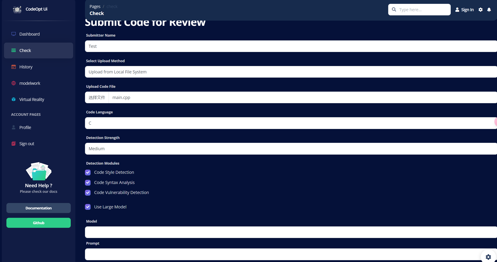
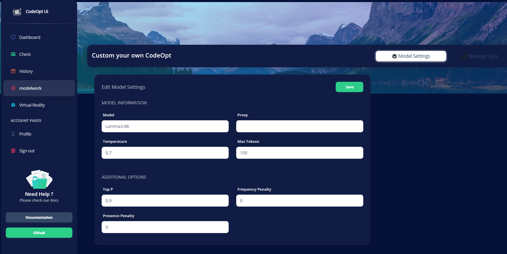

# 软件工程结课作业 - 可视化代码审查工具 

## 项目简介

本项目是一个集成多个代码审计工具的可视化代码审查工具，使用技术栈包括 Vue 3、Argon Dashboard framework、Flask 和 SQLite / MySQL。


<p align="center">
	
</p>
<h2 align="center" style="margin: 30px 0 30px; ">CodeOPT</h2>

### 功能特性

- 通过 web 端提交待检测程序
- 配置用户个人需要的审计策略（如审计项目、LLM 总结、检测力度等策略的组合）
- 集成多个审计工具和LLM，生成审计报告供用户参考
- 通过 web 查看近期用户使用频率、历史记录等


## 项目部署

### 手动部署

>Flask 默认运行在本地 10262 
>
>Vue3 默认运行在本地 10265
>
>Mysql(若启用) 默认运行在 3306
>
>LLM Api(Optional) 默认允许在 10268

#### 后端部署

1. 克隆代码仓库到本地：
    ```bash
    git clone https://github.com/FondH/codeOpt.git
    ```

2. 进入后端目录：
    ```bash
    cd api
    ```

3. 安装依赖：
    ```bash
    pip install -r requirements.txt
    ```

4. 运行后端程序：
    ```bash
    python app.py
    ```

#### 前端部署

1. 进入前端目录 并安装依赖：
    ```bash
    cd CodeOptUI
    ```

    ```bash
    npm install  #安装依赖：
    ```
    
4. 构建前端程序：
    ```bash
    npm run build
    ```

5. 其他脚本：
    
    ```bash
    npm run serve     #调试前端程序
    npm run lint      #代码检查
    npm run prettify  #代码格式化
    ```


#### CodeClimte 部署（optional）

若仅检测C/C++,Python,Java 则无需部署

~~~bash
docker pull codeclimate/codeclimate
~~~


#### LLM 部署（optional）

这里以免费部署在CloudFlare 的llm使用为例，若需要部署其余模型，可参照`codeopt\api\tools\llm\client.py` 对`RemoteClient`重新实现。

1. 安装 Wrangler

   ~~~bash
   npm install wrangler --save-dev
   npx wrangler --version # 查询 wrangler 版本,检测Wrangler成功安装，此时返回其版本号
   ~~~

2.  登录 Wrangler

   ~~~bash
   npx wrangler login
   ~~~

3. 进入工作目录，开启Api

   ~~~bash
   cd cloudflare_api
   npx wrangler dev
   ~~~


### Docker 镜像部署

> **注意：** 该部分部署尚未完成。

## 项目功能和界面展示

（此部分请根据项目的具体功能和界面截图进行补充）

1. **功能一：**

    - 用户认证：用户登录后凭借服务器提供的jwt访问服务器资源，以保证用户身份的合法

    

    ​	

2. **功能二：**
    
    - 代码提交、后台轮询任务并检测
    - 
    
3. **功能三：**

    - 代码报告生成

    - 

    - LLM 输出建议

      

      

4. **功能四**

    - 历史提交记录查看
    - 

5. **功能五**

    - 近期提交数据overview
    - 

6. 定制个性化检测策略、大模型参数

    - 设置策略组合

      

    - （optional）若大模型可用...

      

    
    

## Ref

- vue-argon-dashboard [脚手架](https://github.com/creativetimofficial/vue-argon-dashboard/tree/main/public )
- codeClimate 
- Vue3


